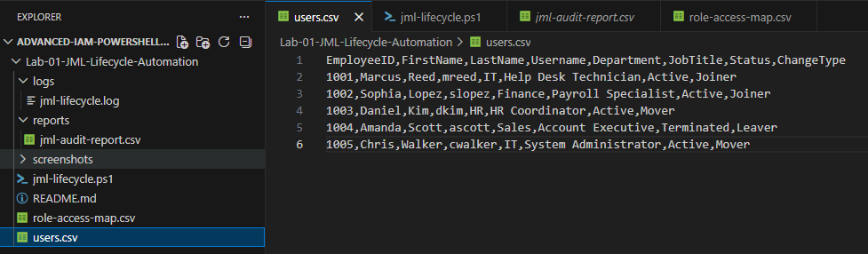
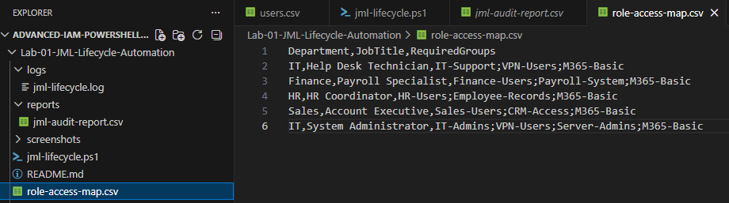
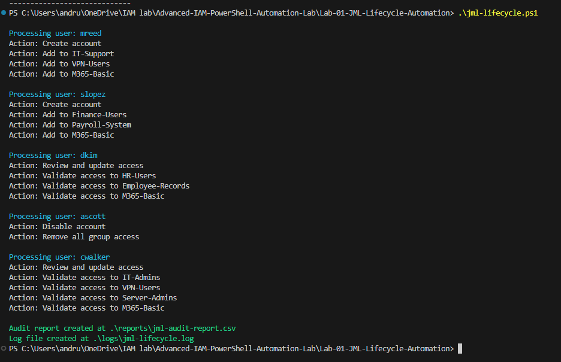
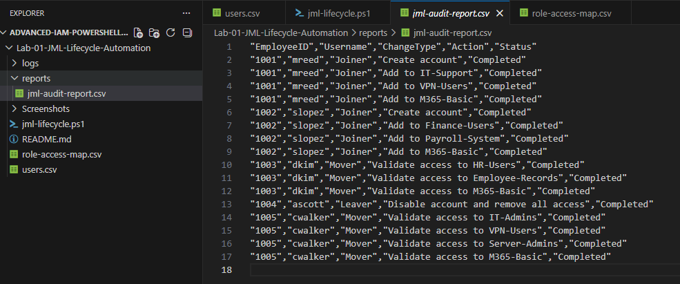
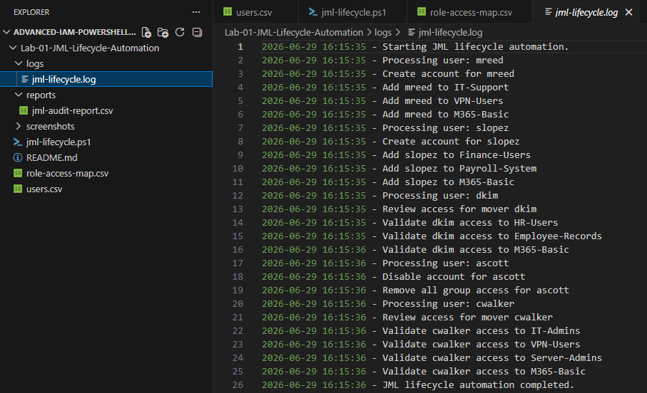
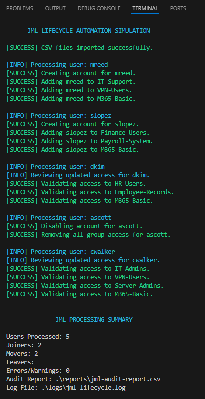

# Lab 01 - JML Lifecycle Automation

## Overview

This lab simulates an IAM Joiner, Mover, and Leaver lifecycle workflow using PowerShell.

The script imports mock HR user data and a role-based access map, determines the required access for each user, simulates IAM actions, writes activity to a log file, and exports an audit report.

## Skills Demonstrated

- PowerShell scripting
- CSV import with `Import-Csv`
- Joiner/Mover/Leaver IAM workflow
- Role-based access mapping
- Logging
- Audit reporting
- Error and warning handling
- Basic automation structure

## Files

| File/Folder | Purpose |
|---|---|
| `jml-lifecycle.ps1` | Main PowerShell automation script |
| `users.csv` | Mock HR user feed |
| `role-access-map.csv` | Role-based access mapping file |
| `logs/` | Stores script execution logs |
| `reports/` | Stores generated audit reports |
| `screenshots/` | Stores project screenshots |

## Screenshots

### Folder Structure


### Users CSV



### Role Access Map



### Initial Script Output



### Audit Report



### Log File



### Enhanced Terminal Output



## What the Script Does

1. Imports user data from `users.csv`.
2. Imports role mappings from `role-access-map.csv`.
3. Matches users to required access based on department and job title.
4. Processes users based on Joiner, Mover, or Leaver status.
5. Logs all simulated IAM actions.
6. Exports an audit report.
7. Displays a processing summary.

## Example IAM Actions Simulated

- Create user account
- Add user to role-based access groups
- Validate access for movers
- Disable leaver accounts
- Remove group access
- Flag records that require review

## How to Run

Open PowerShell from this lab folder and run:

```powershell
.\jml-lifecycle.ps1
