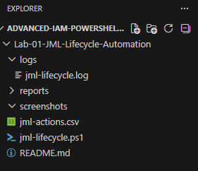
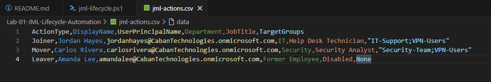
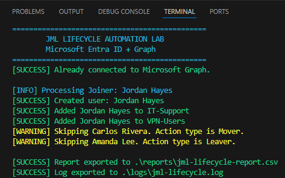
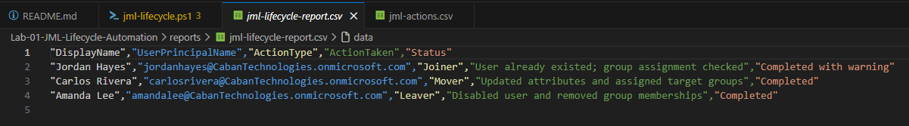
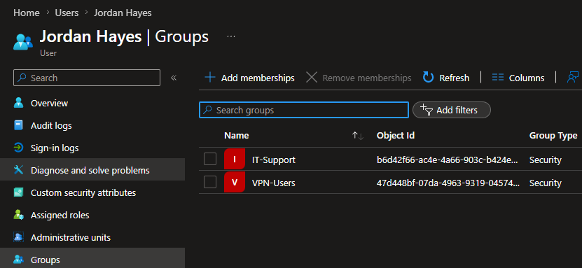

# Lab 01 - JML Lifecycle Automation

## Overview

This lab demonstrates a complete **Joiner, Mover, and Leaver (JML)** lifecycle automation workflow using **PowerShell**, **Microsoft Graph PowerShell SDK**, and **Microsoft Entra ID**.

This lab performs real identity lifecycle operations against a Microsoft Entra tenant by reading HR data from a CSV file and automating user provisioning, role changes, and offboarding.

---

# Objectives

- Connect to Microsoft Graph
- Import HR lifecycle data from CSV
- Automate Joiner provisioning
- Automate Mover role changes
- Automate Leaver offboarding
- Generate audit reports
- Generate execution logs

---

# Technologies Used

- Microsoft Entra ID
- Microsoft Graph PowerShell SDK
- PowerShell 7
- Visual Studio Code
- CSV
- Git
- GitHub

---

# Project Structure

```text
Lab-01-JML-Lifecycle-Automation
│
├── jml-lifecycle.ps1
├── jml-actions.csv
├── README.md
│
├── logs
│   └── jml-lifecycle.log
│
├── reports
│   └── jml-lifecycle-report.csv
│
└── screenshots
```

---

# Workflow

```text
HR CSV
   │
   ▼
PowerShell Automation
   │
   ▼
Microsoft Graph
   │
   ▼
Microsoft Entra ID
```

The automation reads HR lifecycle events from a CSV file and performs the appropriate identity operation for each user.

---

# Joiner Workflow

The Joiner process performs the following actions:

- Checks whether the user already exists
- Creates a new Microsoft Entra user if needed
- Assigns department
- Assigns job title
- Adds the user to the required security groups
- Logs each action
- Records the operation in the audit report

---

# Mover Workflow

The Mover process performs the following actions:

- Locates the existing user
- Updates department
- Updates job title
- Assigns new security group memberships
- Removes outdated security group memberships to prevent access creep
- Logs each action
- Records the operation in the audit report

---

# Leaver Workflow

The Leaver process performs the following actions:

- Locates the existing user
- Disables the Microsoft Entra account
- Removes all security group memberships
- Updates user attributes
- Logs each action
- Records the operation in the audit report

---

# Skills Demonstrated

- Microsoft Graph PowerShell
- Identity Lifecycle Management (JML)
- Microsoft Entra ID Administration
- PowerShell Functions
- CSV Data Processing
- Security Group Automation
- User Provisioning
- User Offboarding
- Error Handling
- Logging
- Audit Reporting

---

# Screenshots

## Folder Structure



---

## HR Lifecycle CSV



---

## PowerShell Automation



---

## Audit Report



---

## Microsoft Entra Verification



---

# Output

The automation generates:

```text
reports/jml-lifecycle-report.csv
logs/jml-lifecycle.log
```

These artifacts provide an audit trail of every lifecycle action performed.

---

# Lessons Learned

This project provided hands-on experience with automating identity lifecycle management using Microsoft Graph PowerShell.

During development, several real-world IAM scenarios were encountered and resolved, including:

- Microsoft Graph authentication using PowerShell 7
- Module compatibility between Windows PowerShell and PowerShell 7
- Security group assignment automation
- Access creep remediation during user role changes
- User lifecycle automation against a live Microsoft Entra tenant
- Logging and audit reporting for identity operations

---
